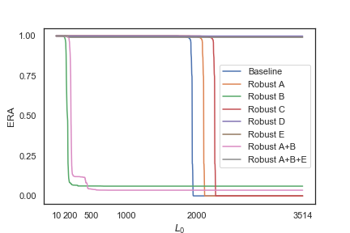
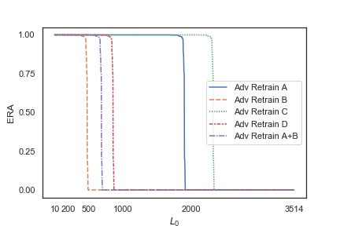
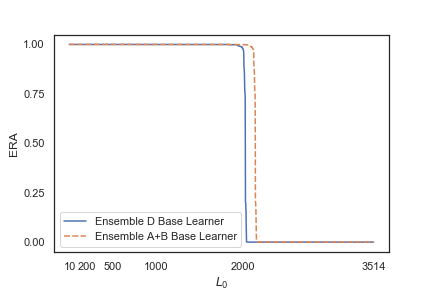

# MalGAN Attack

We implement MalGAN to attack several robust models and evaluate the performance of those robust models.

## Introduction

The GAN attacker has a generator and a substitute detector(discriminator). The generator takes a malware feature vector m, and a noise vector z (append at the end) as input and generates an adversarial example based on that malware sample. The substitute detector is used to fit the behavior of the blackbox classifier and feed the gradient information back to the generator. The idea is based on [Generating Adversarial Malware Examples for Black-Box Attacks Based on GAN](https://arxiv.org/pdf/1702.05983.pdf) by Weiwei Hu and Ying Tan.

## Data

### Train Data: 
13190 samples, each with 3514 API features. The first 6896 are malware example; the last 6294 are benign examples.

### Test Data: 
3435 malware samples, each with 3514 API features.

## Models

### Robust Properties
A   Subtree Deletion Distance 1 
B   Subtree Insertion Distance 1 
C   Subtree Deletion Distance 2 
D   Subtree Insertion Distance 41 
E   Subtree Insertion Distance 42 

### Models evaluated in this project: 
Baseline 
Adv Retrain A 
Adv Retrain B 
Retrain C 
Adv Retrain D 
Adv Retrain A+B 
Ensemble A+B Base Learner 
Ensemble D Base Learner 
Robust A   
Robust B   
Robust C   
Robust D   
Robust E   
Robust A+B   
Robust A+B+E  

For explanation on the detail of the models, please see [On Training Robust PDF Malware Classifiers](https://arxiv.org/pdf/1904.03542.pdf) by Yizheng Chen et al and the [project codebase](https://github.com/surrealyz/pdfclassifier).

## Setup and Mean of Measurement

### Generator
input: malware + noise (append at the end) 
output: adversarial malware examples

### Blackbox Detector (robust model)
input: adversarial malware examples & benign examples 
output: predicted labels for adversarial malware examples & benign examples

All models used in this project can be found [here](https://github.com/surrealyz/pdfclassifier/tree/master/models/adv_trained).

### Substitute Detector
input: adversarial malware examples & benign examples and their predicted labels by the Blackbox Detectorl 
output: validity

After each epoch, we evaluate the performance of generator on our test data.

Successful Evasion:
A malware has a label of 1 but is wrongly classified by the classifier as a label of 0 (benign)

For each successful evasion malware, we remove it from the test dataset. In other words, we only keep testing the malware that still could not fool the classifier.

For each successful evasion, we store the malware into a dictionary, with key being SHA-1 hash and value being the L0 distance between a malware and its adversarial counterpart.

We repeat the above steps 3 times for each epoch to check if random noise added to the malware example could help fool the classifier.

## Result

After 50 epochs, we plot the graph showing the relationship between model ERA(estimated robust accuracy) and L0 distance between a malware and its adversarial counterpart.

According to the plot, we can see that Baseline Robust A, and Robust C are completely evaded, with Robust A/Robust C model having a higher L0 distance than that of Baseline model. In other words, it is harder for a malware example to fool the Robust A/Robust C classifier because more change is needed.

While less change is needed for most malware to evade Robust B and Robust A+B than Baseline model, Robust B and Robust A+B classifier are not completely evaded after 50 epochs. Robust B maintains an ERA of 6.08% and Robust A+B has an ERA of 3.55%.

Robust D, Robust E, and Robust A+B+E are robust against MalGAN, with Estimated Robust Accuracy(ERA) being 99.91%, 99.24%, and 99.18% respectively. 

## Other Result

### Retrain Models
All retrain models are completely evaded by MalGAN after one epoch of training.

### Ensemble Models
All ensemble models are completely evaded by MalGAN after one epoch of training.

### Loss plots
loss plots for all models are also included in this repository. 

## Contributing

Pull requests are welcome. For major changes, please open an issue first to discuss what you would like to change.
Please make sure to update tests as appropriate.

## License
[MIT](https://choosealicense.com/licenses/mit/)

